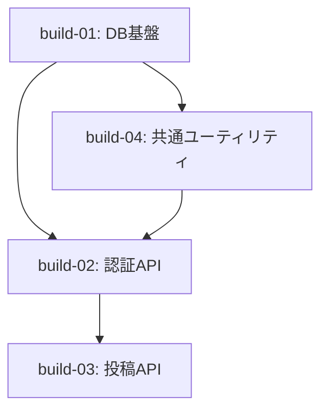

# ビルド管理 テンプレート集

## tasklist.md

`tasklist.md` の生成・更新はスクリプトが行います。手で書き換えず、
`hikyaku tasklist add / update / done` を使ってください（依存グラフの再生成と
循環依存の検証が同時に行われます）。

````markdown
# ビルド一覧 — 002-billing

ビルドの完了判定は `PR` 列が非空かどうかで行います。
`PR` 列の更新は当該ビルドの PR に同梱されるため、デフォルトブランチ上で
`PR` 列が埋まっていること自体がマージ済みを意味します。

依存関係のあるビルドは、先行ビルドがデフォルトブランチにマージ済みであることが必須です。
依存関係がないビルドは並行実行できます。

| buildID | title              | BP | dependencies | issue                        | PR         |
| ------- | ------------------ | -- | ------------ | ---------------------------- | ---------- |
| 1       | DB基盤             | 2  | —            | [issue](./build-01/issue.md) | pr/10      |
| 2       | 認証API            | 3  | 1, 4         | [issue](./build-02/issue.md) | —          |
| 3       | 投稿API            | 3  | 2            | [issue](./build-03/issue.md) | —          |
| 4       | 共通ユーティリティ | 2  | 1            | [issue](./build-04/issue.md) | —          |

## 依存グラフ


````

**カラム説明:**

| 列 | 意味 |
|---|---|
| `buildID` | 作成順の連番。`max(既存) + 1` で採番し、リナンバリングは行わない |
| `title` | ビルド名 |
| `BP` | ビルドポイント（[bp-guide.md](bp-guide.md) 参照） |
| `dependencies` | 依存ビルドID。実行順序はこの依存グラフで決まる |
| `issue` | `build-{NN}/issue.md` への相対リンク。作成時に記録し以後不変 |
| `PR` | **完了判定に使う唯一の列**。当該ビルドの PR に同梱して更新する |

**`PR` 列を先にデフォルトブランチへ入れてはいけません。** 未マージのビルドを
完了と誤判定します。`hikyaku tasklist done` の結果は、必ずそのビルドの PR に含めてください。

**status 列は持ちません。** PR 列の更新が当該ビルドの PR に同梱される以上、
デフォルトブランチ上で PR 列が埋まっていること自体が「マージ済み = 完了」を意味します。
status 列を別に持つと「status は done だが PR 列が空」という嘘の状態が作れてしまいます。

## build-{NN}/issue.md

issue.md の本文は build-manager（LLM）が書きます。tasklist.md の行は
スクリプトが書きます。この分担により、長い Markdown をスクリプトへ渡す必要がなくなります。

```markdown
# Build {NN}: {ビルド名}

## やること

- （スコープ内の作業）

## やらないこと

- （明示的なスコープ外。ここを書かないとスコープが膨らむ）

## 受け入れ基準

- [ ] （完了条件1）
- [ ] （完了条件2）

## 参照する設計ドキュメント

- （design-delta.md の該当箇所、永続ドキュメントの該当箇所）
```
