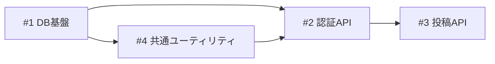

# ビルド管理 テンプレート集

## tasklist.md

````markdown
# ビルド一覧

| buildID | title | BP | dependencies | issue | PR |
|---------|-------|----|--------------|-------|----|
| 1 | DB基盤 | 2 | | [issue](./build-01/issue.md) | |
| 2 | 認証API | 3 | 1,4 | [issue](./build-02/issue.md) | |
| 3 | 投稿API | 3 | 2 | [issue](./build-03/issue.md) | |
| 4 | 共通ユーティリティ | 2 | 1 | [issue](./build-04/issue.md) | |

## builder呼び出し

```
/hikyaku:builder {DOC_ROOT}
```

## 依存グラフ



## ビルド要約

ビルド要約はビルドの推奨解決順に並んでいるため、BuildIDが前後することがあります。

### Build 01: DB基盤
Prisma導入、DBマイグレーションの整備

### Build 04: 共通ユーティリティ
共通ユーティリティの整備（Build 01 から分割）

### Build 02: 認証API
メールアドレス・パスワード認証のAPI実装（セッション管理含む）

### Build 03: 投稿API
メッセージ投稿APIの実装
````

**カラム説明:**
- **buildID**: ビルドの一意識別子（ゼロ埋め2桁: 01, 02, ...）。作成順の連番で、実行順序とは一致しない場合がある
- **title**: ビルド名
- **BP**: ビルドポイント（bp-guide.md 参照）
- **dependencies**: 依存ビルドID（カンマ区切り）。実行順序はこの依存グラフで決定される
- **issue**: `build-{NN}/issue.md` への相対リンク（`[issue](./build-{NN}/issue.md)`）。build-manager が作成時に記録し、以後不変
- **PR**: PR番号またはURL（BUILDフェーズ完了後に記入）

**`issue_backend` による列の違い:** 上記は `issue_backend = "file"`（デフォルト）の場合の列構成です。`issue`/`task`列はどのbackendでもMarkdownリンク形式ですが、リンク先が異なります。`github` の場合は `issue` 列の値が `[#12](https://github.com/owner/repo/issues/12)` のようなissue URLへのリンクになります。`asana` の場合は `issue` 列が `task` 列に置き換わり、`[<gid>](<permalink_url>)` のようなAsana task URLへのリンクを記録します（issue.md自体はローカルに常設されず外部レコードが正のため、相対リンクではなくtask URLで参照する）。**`PR` 列はどのbackendでも共通で存在し**、builderがStep 10で記録します（`github`/`asana`では可視化目的のみで、完了判定には使いません）。詳細は [backends.md](backends.md) を参照してください。

**依存グラフの書き方:**
- テーブルの dependencies 列と同じ情報を Mermaid `graph LR` で記述する
- ノードラベルは `buildID["#buildID title"]` の形式
- エッジは `依存元 --> 依存先` の形式（依存元の完了後に依存先を実行可能）

## build-{NN}/issue.md

```markdown
# Build {NN}: {ビルド名}

## やること

- （スコープ内の作業）

## やらないこと

- （明示的なスコープ外）

## 受け入れ基準

- [ ] （完了条件1）
- [ ] （完了条件2）
```
