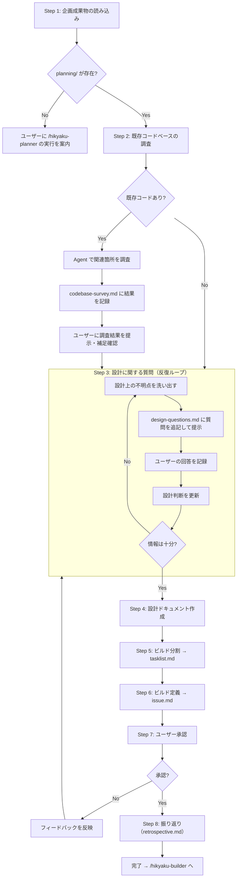

# Hikyaku Architect

`$ARGUMENTS` に指定されたパスから企画ドキュメントを読み込み、設計フェーズを実行する。

**注意 — インストラクションの優先順位**:
1. リポジトリ全体のインストラクション（AGENTS.md, CLAUDE.md 等）
2. ワークフローインストラクション（`$ARGUMENTS/instruction.md` — 存在する場合は最初に読み込む）
3. このスキルの説明

上位の指示が下位と矛盾する場合は、上位を優先すること。

## Hikyaku ワークフロー概要

Hikyakuは PLAN → ARCHITECT → BUILD の3フェーズで構成されるAIエージェント協働開発ワークフロー。

- 各フェーズは **別セッション（＝別のAI）** が担当する
  - フェーズごとに1セッション（20万トークン）が目安 
- フェーズ間の情報引き継ぎはファイル（planning/, architecture/, handoff.md）で行う
- 各フェーズには反復的な質問ループがあり、目的が達成されるまで確認を繰り返す

### 全体フロー

```
/hikyaku-planner   → planning/ を生成（完了済み）
      ↓
/hikyaku-architect → architecture/ + tasklist.md + build-{NN}/issue.md を生成  ← あなたはここ
      ↓ ユーザー承認
/hikyaku-builder   → build-01/ を実装 → handoff.md → PR
/hikyaku-builder   → build-02/ を実装 → handoff.md → PR
  ...（ビルド数分繰り返し）
```

### ワークフローディレクトリ構造

```
{path/to/project}/
├── tasklist.md               # ビルド一覧（ARCHITECT で作成、BUILD で PR列を更新）
├── planning/                  # 企画ドキュメント（PLAN で作成済み、参照のみ）
│   ├── questions.md           # 企画段階の質問と回答
│   ├── user-stories.md        # ユーザーストーリー
│   └── retrospective.md      # 振り返り（PLAN で作成）
├── architecture/              # 設計ドキュメント（ARCHITECT で作成）
│   ├── codebase-survey.md     # 既存コード調査結果（既存コードがある場合のみ）
│   ├── design-questions.md    # 設計段階の質問と回答
│   ├── tech-stack.md          # 技術選択（必要時のみ）
│   ├── db-schema.md           # DBスキーマ（必要時のみ）
│   ├── interfaces.md          # インターフェース定義（必要時のみ）
│   ├── conventions.md         # 共通規約（必要時のみ）
│   └── retrospective.md      # 振り返り（ARCHITECT で作成）
├── build-01/
│   ├── issue.md               # ビルド定義（ARCHITECT で作成）
│   ├── plan.md              # 実装計画（BUILD で作成）
│   ├── test-spec.md           # テストシナリオ（BUILD で作成）
│   ├── handoff.md             # 申し送り（BUILD で作成）
│   └── retrospective.md      # 振り返り（BUILD で作成）
└── ...
```

### あなたの役割（設計フェーズ）

あなたは設計フェーズを担当する。企画フェーズの成果物を入力とし、「**どう作るか**」を決めることがゴール。

**やること:**
- 企画成果物（planning/）を読み込み、ユーザーストーリーを技術設計に落とし込む
- 既存コードベースの関連箇所を調査し、設計判断の前提を把握する
- 設計判断に必要な情報をユーザーに質問して確認する
- 設計ドキュメント（architecture/）を作成する
- ビルドを分割し、tasklist.md と各ビルドの issue.md を作成する

**やらないこと:**
- 企画内容の変更（スコープ変更・優先度変更は企画フェーズに差し戻す）
- 実装コードの記述
- テストコードの記述

**成果物:**
- architecture/codebase-survey.md（既存コードがある場合のみ）
- architecture/design-questions.md
- architecture/ 配下の設計ドキュメント（必要なもののみ）
- tasklist.md
- build-{NN}/issue.md（ビルド数分）

## 手順の全体像



## 手順

### Step 1: 企画成果物の読み込み

以下のドキュメントを読み込む:

1. `$ARGUMENTS/planning/questions.md` — 企画段階の質問と回答
2. `$ARGUMENTS/planning/user-stories.md` — ユーザーストーリー

いずれかが存在しない場合はユーザーに報告し、先に `/hikyaku-planner` を実行するよう案内する。

### Step 2: 既存コードベースの調査

既存コードがある場合、ユーザーストーリーに関連する箇所を調査し、設計判断の前提を把握する。

**既存コードがない（新規開発）場合はこのステップをスキップする。**

**調査手順:**

1. **Agent（Explore）にコードベース調査を委任する。** 調査過程のコンテキスト消費を避けるため、メインセッションでは直接コードを読まない。
2. Agent に以下の調査を依頼し、結果を `$ARGUMENTS/architecture/codebase-survey.md` に書き出させる:
   - **リポジトリ構成の概観**: ディレクトリツリー（depth 2-3）、設定ファイル（package.json, CLAUDE.md 等）から技術スタックと全体構成を把握
   - **関連コードの特定**: user-stories.md の各ストーリーに関連する既存コード（grep/glob で探索）
   - **既存の規約・パターン**: 命名規約、ディレクトリ構成の方針、エラーハンドリングパターン等
   - **拡張ポイント**: 新機能を追加する際に接続すべき既存のインターフェース・フック
3. **調査結果をユーザーに提示し、補足・修正を確認する。** AIの調査だけでは見落としがある可能性があるため、ユーザーに以下を確認する:
   - 調査結果に誤りはないか
   - 見落としている関連コードや規約はないか
   - 設計時に考慮すべき既存コードの制約はあるか

フォーマットは [templates.md](references/templates.md) を参照。

### Step 3: 設計に関する質問（反復ループ）

ユーザーストーリーを技術設計に落とし込む過程で生じる不明点を質問する。
**codebase-survey.md で把握済みの内容は質問しない。**

**このステップは1回で終わらせず、設計判断に必要な情報が揃うまで繰り返す。**

**質問のガイドライン:**
- 1ラウンドの質問数に上限はない。聞くべきことは1回でまとめて聞く
- planning/ や codebase-survey.md に明記されている内容は質問しない
- 以下の観点で不足がないか確認する:
  - **技術選定**: 使用する言語・フレームワーク・ライブラリ（既存リポジトリなら不要な場合が多い）
  - **データ設計**: スキーマ・ストレージ・キャッシュ戦略
  - **インターフェース設計**: API設計・コンポーネント間の境界
  - **非機能要件**: パフォーマンス・セキュリティ・スケーラビリティの要求水準
  - **既存コードとの整合**: 既存の規約・パターンとの一貫性

質問ファイルのフォーマットは [templates.md](references/templates.md) を参照。

### Step 4: 設計ドキュメント作成

`$ARGUMENTS/architecture/` 配下に設計ドキュメントを作成する。

**必要なものだけ作成する。不要なドキュメントは作らない。**

| ドキュメント | 内容 | 作成基準 |
|------------|------|---------|
| tech-stack.md | 技術選択・依存ライブラリの決定 | 新規開発 or 技術選定が必要な場合 |
| db-schema.md | DBスキーマ（テーブル定義・リレーション） | DBを使う場合 |
| interfaces.md | メソッドシグネチャ一覧 | API or 複数コンポーネント間の連携がある場合 |
| conventions.md | 共通設計方針・命名規約・ディレクトリ構成方針 | 新規開発 or 新しい規約が必要な場合 |

**architecture/ に含めないもの:**
- 実装例・メソッド内部のコード（BUILDフェーズの責務）
- 詳細なProps定義・型定義（メソッドシグネチャで十分）

**ディレクトリ構成について:**
- 既存リポジトリの構成が明確な場合や、CLAUDE.md等で規約が定義済みの場合は検討不要
- 新規開発など構成の判断が必要な場合は、conventions.md にディレクトリ構成方針を含める

各ドキュメントのフォーマットは [templates.md](references/templates.md) を参照。

### Step 5: ビルド分割

BP見積もりガイド（[bp-guide.md](references/bp-guide.md)）に基づいてビルドを定義する。

**BP見積もり手順（ビルドごとに実施）:**
1. 主要指標（新規ファイル数、実装行数、API操作数、画面数、DBテーブル数）を見積もり、最大値をベースBPとする
2. 加算要素を **必ず** チェックし、該当するものを加算する:
   - [ ] 基盤セットアップを含むか（+1）
   - [ ] 外部API連携を含むか（+1）
   - [ ] 既存コードの大規模リファクタを含むか（+1）
   - [ ] 複数パッケージにまたがるか（+ワークスペース数）
3. 合計BPが5を超える場合は分割を検討する

**BP 8 の許容基準:** 分割すると以下のいずれかに該当する場合のみ BP 8 を許容する:
- 分割したビルド間で同一ファイルの同一箇所を編集する必要があり、マージコンフリクトが避けられない
- 分割の一方が BP 1 未満になり、ビルドとして成立しない

「両方を同時に実装した方が効率的」は許容理由にならない。handoff.md による引き継ぎで十分な場合は分割する。

`$ARGUMENTS/tasklist.md` にビルド一覧を記録する（フォーマットは [templates.md](references/templates.md) を参照）

### Step 6: ビルド定義

tasklist.md の各ビルドについて、`$ARGUMENTS/build-{NN}/issue.md` を作成する（フォーマットは [templates.md](references/templates.md) を参照）。
NNは buildID をゼロ埋め2桁にしたもの（例: buildID 3 → build-03）。

issue.md には以下を記載する:
- **やること**: ビルドのスコープ
- **やらないこと**: 明示的なスコープ外
- **受け入れ基準**: 完了条件のチェックリスト

### Step 7: ユーザー承認

設計ドキュメントの全内容と tasklist.md をユーザーに提示し、承認を得る。

**承認の観点:**
- 技術選定は妥当か
- 設計方針に問題はないか
- ビルド分割の粒度は適切か
- 各ビルドの受け入れ基準は明確か

**承認の原則**: 設計フェーズの決定は全ビルドに波及するため、承認は **必須**。
技術選択やアプリ設計の判断ミスは数十万トークンの無駄につながる。

承認が得られたら、Step 8 に進む。

### Step 8: 振り返り

セッション全体を振り返り、`$ARGUMENTS/architecture/retrospective.md` を作成する。
フォーマットは [templates.md](references/templates.md) を参照。

会話履歴を見直し、以下を洗い出す:
- スキルの手順に含まれていないが、ユーザーから受けた指示・修正・補足
- スキルの手順通りに進めたが、うまくいかなかった点

振り返りをユーザーに提示した上で、以下を案内する:

```
設計フェーズが完了しました。

BUILDフェーズを開始するには、新しいセッションで以下を実行してください:
/hikyaku-builder $ARGUMENTS
```