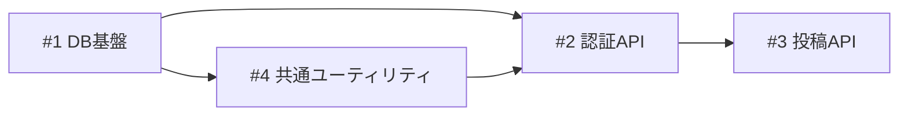

# ビルド管理 テンプレート集

## tasklist.md

````markdown
# ビルド一覧

| buildID | title | BP | dependencies | PR |
|---------|-------|----|--------------|----|
| 1 | DB基盤 | 2 | | |
| 2 | 認証API | 3 | 1,4 | |
| 3 | 投稿API | 3 | 2 | |
| 4 | 共通ユーティリティ | 2 | 1 | |

## 依存グラフ



## ビルド要約

ビルド要約はビルドの推奨解決順に並んでいるため、BuildIDが前後することがあります。

### Build 01: DB基盤
Prisma導入、DBマイグレーションの整備

### Build 04: 共通ユーティリティ
共通ユーティリティの整備（Build 01 から分割）

### Build 02: 認証API
メールアドレス・パスワード認証のAPI実装（セッション管理含む）

### Build 03: 投稿API
メッセージ投稿APIの実装
````

**カラム説明:**
- **buildID**: ビルドの一意識別子（ゼロ埋め2桁: 01, 02, ...）。作成順の連番で、実行順序とは一致しない場合がある
- **title**: ビルド名
- **BP**: ビルドポイント（bp-guide.md 参照）
- **dependencies**: 依存ビルドID（カンマ区切り）。実行順序はこの依存グラフで決定される
- **PR**: PR番号またはURL（BUILDフェーズ完了後に記入）

**依存グラフの書き方:**
- テーブルの dependencies 列と同じ情報を Mermaid `graph LR` で記述する
- ノードラベルは `buildID["#buildID title"]` の形式
- エッジは `依存元 --> 依存先` の形式（依存元の完了後に依存先を実行可能）

## build-{NN}/issue.md

```markdown
# Build {NN}: {ビルド名}

## やること

- （スコープ内の作業）

## やらないこと

- （明示的なスコープ外）

## 受け入れ基準

- [ ] （完了条件1）
- [ ] （完了条件2）
```
