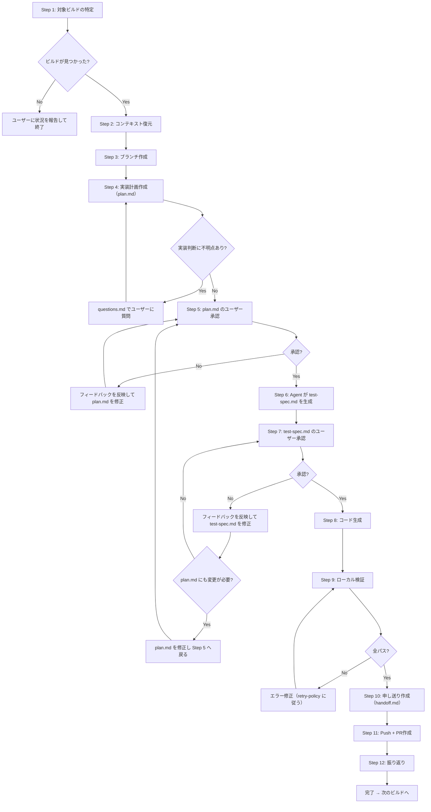

# Hikyaku Builder

`$ARGUMENTS[0]` のワークフローパスから企画・設計ドキュメントを読み込み、実装フェーズを実行する。`$ARGUMENTS[1]` で buildID を指定できる（省略時は次のビルドを自動選択）。

**注意 — インストラクションの優先順位**:
1. リポジトリ全体のインストラクション（AGENTS.md, CLAUDE.md 等）
2. ワークフローインストラクション（`$ARGUMENTS[0]/instruction.md` — 存在する場合は最初に読み込む）
3. このスキルの説明

上位の指示が下位と矛盾する場合は、上位を優先すること。

## Hikyaku ワークフロー概要

Hikyakuは PLAN → ARCHITECT → BUILD の3フェーズで構成されるAIエージェント協働開発ワークフロー。

- 各フェーズは **別セッション（＝別のAI）** が担当する
   - フェーズごとに1セッション（20万トークン）が目安
- BUILDセッションは設計ドキュメント（architecture/）と、先行ビルドの申し送り（handoff.md）を読んでコンテキストを復元する
- 1ビルド＝1セッションで完結させる
- セッション間の情報引き継ぎはファイル（planning/, architecture/, handoff.md）で行う

### 全体フロー

```
/hikyaku-planner   → planning/ を生成（完了済み）
      ↓
/hikyaku-architect → architecture/ + tasklist.md + build-{NN}/issue.md を生成（完了済み）
      ↓
/hikyaku-builder   → build-01/ を実装 → handoff.md → PR
/hikyaku-builder   → build-02/ を実装 → handoff.md → PR  ← あなたはここ
  ...（ビルド数分繰り返し）
```

### ワークフローディレクトリ構造

```
{path/to/project}/
├── tasklist.md               # ビルド一覧（ARCHITECT で作成済み、BUILD で PR列を更新）
├── planning/                  # 企画ドキュメント（PLAN で作成済み、参照のみ）
│   ├── questions.md           # 企画段階の質問と回答
│   ├── user-stories.md        # ユーザーストーリー
│   └── retrospective.md      # 振り返り（PLAN で作成）
├── architecture/              # 設計ドキュメント（ARCHITECT で作成済み、実装時に差分があれば更新）
│   ├── codebase-survey.md     # 既存コード調査結果（任意）
│   ├── design-questions.md    # 設計段階の質問と回答
│   ├── tech-stack.md          # 技術選択（任意）
│   ├── db-schema.md           # DBスキーマ（任意）
│   ├── interfaces.md          # インターフェース定義（任意）
│   ├── conventions.md         # 共通規約（任意）
│   └── retrospective.md      # 振り返り（ARCHITECT で作成）
├── build-01/                  # 完了済みビルド
│   ├── issue.md               # ビルド定義（ARCHITECT で作成済み）
│   ├── plan.md              # 実装計画
│   ├── test-spec.md           # テストシナリオ
│   ├── handoff.md             # 申し送り → 後続ビルドが参照
│   └── retrospective.md      # 振り返り
├── build-02/                  # ← これから作業するビルド
│   ├── issue.md               # ビルド定義（ARCHITECT で作成済み）
│   ├── plan.md              # ← BUILD で作成
│   ├── test-spec.md           # ← BUILD で作成（テストシナリオ）
│   ├── questions.md           # （必要時のみ）
│   ├── handoff.md             # ← BUILD で作成
│   └── retrospective.md      # ← BUILD で作成
└── ...
```

### あなたの役割（実装フェーズ）

あなたは実装フェーズの1ビルドを担当する。企画・設計は別セッションで完了済み。
設計ドキュメント（architecture/）と先行ビルドの handoff.md を読んでコンテキストを復元し、実装→検証→申し送り→PRまでを完結させる。

**やること:**
- 対象ビルドの issue.md に基づいて実装計画（plan.md）を作成する
- テストシナリオ（test-spec.md）を作成する
- コードを実装し、テストを書く
- ローカル検証を通す
- 申し送り（handoff.md）を作成する
- Push + PR作成

**やらないこと:**
- 企画内容の変更（スコープ変更・優先度変更）
- 担当ビルド外のコード変更
- build-manager を通さずにビルドのスコープを直接変更すること

**設計ドキュメントの更新について:**
- 実装中に planning/ や architecture/ の内容と異なる判断が必要になった場合は、該当ドキュメントを直接更新する（ソースオブトゥルースを1箇所に保つ）

## 手順の全体像



## 手順

### Step 1: 対象ビルドの特定

`$ARGUMENTS[0]/tasklist.md` を読み込む。

- `$ARGUMENTS[1]` が数値の場合: 該当する buildID のビルドを対象とする
- `$ARGUMENTS[1]` が省略または `next` の場合: PR列が空かつ、依存ビルド（dependencies列）のPR列がすべて埋まっているビルドの中から、最小のbuildIDを選択する

**注意:** buildID の数値順は実行順序と一致しない場合がある（ビルド分割により後から追加されたビルドが、数値上は大きいが依存グラフ上は先に実行すべきケースがある）。必ず dependencies 列に基づいて判断すること。

対象ビルドが見つからない場合は、ユーザーに状況を報告して終了する。

### Step 2: コンテキスト復元

以下の順でドキュメントを読み込む:

1. `$ARGUMENTS[0]/build-{NN}/issue.md` — 対象ビルドの定義（やること/やらないこと/受け入れ基準）
2. `$ARGUMENTS[0]/architecture/codebase-survey.md` — 既存コードの構成・規約・拡張ポイント（存在する場合）
3. `$ARGUMENTS[0]/architecture/` — その他の関連する設計ドキュメントを参照
4. 依存ビルド（dependencies列）の `$ARGUMENTS[0]/build-{NN}/handoff.md` を読み込む
   - **直接依存するビルドの handoff.md のみ** 読み込む（全ビルド分は読まない）

### Step 3: ブランチ作成

ビルド用のブランチを作成する。ブランチ名はリポジトリの規約があれば従う。

### Step 4: 実装計画の作成

`$ARGUMENTS[0]/build-{NN}/plan.md` を [templates.md](references/templates.md) のテンプレートに沿って作成する。
NNは buildID をゼロ埋め2桁にしたもの（例: buildID 3 → build-03）。

実装判断に不明点がある場合は `$ARGUMENTS[0]/build-{NN}/questions.md` でユーザーに質問する。

### Step 5: plan.md のユーザー承認

plan.md の内容をユーザーに提示し、承認を得る。

**承認時のユーザーの関心:**
- 依存パッケージの選定は妥当か
- クラス設計（メソッドシグネチャ）は意図通りか
- セキュリティ等の非機能要件が考慮されているか

**ユーザーが関心を持たないもの（提示不要）:**
- 詳細な実装コード
- テストコードの実装方法

**フィードバック時の対応:**
- フィードバックを plan.md に反映し、再度承認を得る

### Step 6: テストシナリオ作成

**Agent にテストシナリオの生成を委任する。** テストケースの洗い出し過程のコンテキスト消費を避けるため、メインセッションでは直接作成しない。

Agent に以下を渡し、`$ARGUMENTS[0]/build-{NN}/test-spec.md` を生成させる:
- `$ARGUMENTS[0]/build-{NN}/plan.md`（依存パッケージ・クラス設計・非機能要件・実装ステップ等）
- `$ARGUMENTS[0]/build-{NN}/issue.md`（ビルド定義）
- `$ARGUMENTS[0]/architecture/` 配下の関連ドキュメント

フォーマットは [templates.md](references/templates.md) を参照。

### Step 7: test-spec.md のユーザー承認

test-spec.md の内容をユーザーに提示し、承認を得る。

**承認時のユーザーの関心:**
- issue.md の受け入れ基準（ソースオブトゥルース）をテストシナリオが網羅できているか
- 正常系・異常系・境界値のカバー範囲は十分か
- 不要なテストや過剰なテストはないか

**フィードバック時の対応:**
- test-spec.md のみの変更の場合: test-spec.md を修正し、再度承認を得る
- plan.md にも変更が必要な場合: plan.md を修正し、Step 5 に戻って plan.md の再承認を得る（承認後、Step 6 で test-spec.md を再生成する）

承認後はコード生成中の個別判断について追加承認は **不要**（plan.md + test-spec.md で方針合意済み）。

### Step 8: コード生成

plan.md の実装ステップに沿って実装する。

- 実装ステップのチェックボックスを完了ごとに更新する
- test-spec.md のシナリオに基づいてテストコードを生成する

### Step 9: ローカル検証

**Push前にリポジトリの規約があれば従い、必ず品質管理を実行する。全ての項目がパスするまでPushしない。**

エラー修正は [retry-policy.md](references/retry-policy.md) の試行回数上限に従う。
上限に達したらユーザーに報告して判断を仰ぐ。

### Step 10: 申し送り作成

`$ARGUMENTS[0]/build-{NN}/handoff.md` を [templates.md](references/templates.md) のテンプレートに沿って作成する。

後続ビルドのセッションがこの handoff.md を読んでコンテキストを復元するため、以下を正確に記録する:
- 公開インターフェース — architecture/interfaces.md に反映済みの内容は省略し、差分・補足のみ記載する
- 技術的判断の記録（ADR）— 実装中に行った判断とその理由
- 環境変更 — 新しい環境変数、DBマイグレーション、設定ファイル等
- 既知の制約・注意点 — 後続ビルドが知るべき前提や制約

**設計ドキュメントとの整合:**
実装中に planning/ や architecture/ の内容と異なる判断をした場合は、handoff.md に書くのではなく **該当する設計ドキュメントを直接更新する**。設計ドキュメントがソースオブトゥルースであり、handoff.md には設計ドキュメントに収まらない実装固有の文脈のみ残す。

### Step 11: Push + PR作成

1. 変更をPushする
2. PRを作成する
3. `$ARGUMENTS[0]/tasklist.md` のPR列を更新する

完了後、Step 12 に進む。

### Step 12: 振り返り

`/hikyaku-retrospective $ARGUMENTS[0] build-{NN}` を呼び出して振り返りを実施する。

振り返り完了後（またはスキップ後）、以下を案内する:

```
Build {NN} が完了しました。

次のビルドを開始するには、新しいセッションで以下を実行してください:
/hikyaku-builder $ARGUMENTS[0]
```

---

## ビルド管理（タスクの追加・変更）

実装中に以下の状況が発生した場合、`/hikyaku-build-manager $ARGUMENTS[0]` を呼び出してビルドの追加・変更を行う。
build-manager がユーザー承認を含むビルド管理の全手順を実行する。

**呼び出しタイミング:**

| タイミング | 状況 | 操作 |
|-----------|------|------|
| Step 4（計画作成）後 | issue.md のスコープが実際にはBP超過と判明 | ビルドの分割 |
| Step 8（コード生成）中 | 想定外の複雑さや未定義の依存が判明 | ビルドの追加・更新 |
| Step 10（申し送り）時 | 意図的に先送りした作業を新ビルドとして記録 | ビルドの追加 |

**build-manager 呼び出し後の対応:**
- 現在のビルドのスコープが変更された場合: plan.md を修正し、Step 5 に戻って再承認を得る（承認後、test-spec.md を再生成する）
- 新ビルドが追加されただけの場合: 現在の作業を続行する

---

## PRレビュー指摘への対応

PRレビューで指摘を受けた場合、同じセッションまたは新しいセッションで以下の手順で修正する:

1. PRのレビューコメントを確認する
2. `$ARGUMENTS[0]/build-{NN}/plan.md` を参照してコンテキストを復元する
3. 指摘内容に基づいて修正を実装する
4. ローカル検証を実行する（Step 9 と同じ）
5. ドキュメント更新チェック — 以下の各ドキュメントについて、修正内容との差分がないか確認し、差分があれば更新する:
   - `$ARGUMENTS[0]/build-{NN}/plan.md` — クラス設計・実装ステップ
   - `$ARGUMENTS[0]/build-{NN}/issue.md` — 受け入れ基準（ソースオブトゥルース）
   - `$ARGUMENTS[0]/build-{NN}/test-spec.md` — テストシナリオの追加・変更
   - `$ARGUMENTS[0]/build-{NN}/handoff.md` — 公開インターフェース・ADR・既知の制約
   - `$ARGUMENTS[0]/architecture/` 配下 — interfaces.md, db-schema.md 等の設計ドキュメント
   - `$ARGUMENTS[0]/planning/` 配下 — 企画レベルの変更があった場合（稀）
6. Pushする
7. 振り返り — `/hikyaku-retrospective $ARGUMENTS[0] build-{NN}` を呼び出す。既に retrospective.md が存在する場合は追記モードで動作する