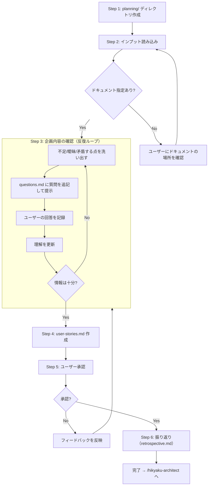

# Hikyaku Planner

`$ARGUMENTS` に指定されたパスにワークフロードキュメントをセットアップし、企画フェーズを実行する。

**注意 — インストラクションの優先順位**:
1. リポジトリ全体のインストラクション（AGENTS.md, CLAUDE.md 等）
2. ワークフローインストラクション（`$ARGUMENTS/instruction.md` — 存在する場合は最初に読み込む）
3. このスキルの説明

上位の指示が下位と矛盾する場合は、上位を優先すること。

## Hikyaku ワークフロー概要

Hikyakuは PLAN → ARCHITECT → BUILD の3フェーズで構成されるAIエージェント協働開発ワークフロー。

- 各フェーズは **別セッション（＝別のAI）** が担当する
  - フェーズごとに1セッション（20万トークン）が目安
- フェーズ間の情報引き継ぎはファイル（planning/, architecture/, handoff.md）で行う
- 各フェーズには反復的な質問ループがあり、目的が達成されるまで確認を繰り返す

### 全体フロー

```
/hikyaku-planner   → planning/ を生成 ← あなたはここ
      ↓ ユーザー承認
/hikyaku-architect → architecture/ + tasklist.md + build-{NN}/issue.md を生成
      ↓ ユーザー承認
/hikyaku-builder   → build-01/ を実装 → handoff.md → PR
/hikyaku-builder   → build-02/ を実装 → handoff.md → PR
  ...（ビルド数分繰り返し）
```

### ワークフローディレクトリ構造

```
{path/to/project}/
├── tasklist.md               # ビルド一覧（ARCHITECT で作成、BUILD で PR列を更新）
├── planning/                  # 企画ドキュメント（PLAN で作成）
│   ├── questions.md           # 企画段階の質問と回答
│   ├── user-stories.md        # ユーザーストーリー
│   └── retrospective.md      # 振り返り（PLAN で作成）
├── architecture/              # 設計ドキュメント（ARCHITECT で作成）
│   ├── codebase-survey.md     # 既存コード調査結果（既存コードがある場合のみ）
│   ├── design-questions.md    # 設計段階の質問と回答
│   ├── tech-stack.md          # 技術選択（必要時のみ）
│   ├── db-schema.md           # DBスキーマ（必要時のみ）
│   ├── interfaces.md          # インターフェース定義（必要時のみ）
│   ├── conventions.md         # 共通規約（必要時のみ）
│   └── retrospective.md      # 振り返り（ARCHITECT で作成）
├── build-01/
│   ├── issue.md               # ビルド定義（ARCHITECT で作成）
│   ├── plan.md              # 実装計画（BUILD で作成）
│   ├── test-spec.md           # テストシナリオ（BUILD で作成）
│   ├── handoff.md             # 申し送り（BUILD で作成）
│   └── retrospective.md      # 振り返り（BUILD で作成）
└── ...
```

### あなたの役割（企画フェーズ）

あなたは企画フェーズを担当する。
ユーザーは既にある程度の企画・要件を持っている。あなたの仕事は、既存のドキュメントやユーザーの説明を読み込み、**次の設計フェーズ（ARCHITECT）が作業を開始できる形に構造化すること**。

**やること:**
- 既存ドキュメントを読み込み、内容を理解する
- 不足・曖昧・矛盾する点をユーザーに質問して解消する
- 情報をユーザーストーリーとして構造化する
- 機能の優先度（Must / Should / Could）を整理する
- スコープ内外の境界を明確にする

**やらないこと:**
- 技術選定（言語、フレームワーク、ライブラリの選択）
- システム設計（DB設計、API設計、アーキテクチャ）
- ビルド分割・見積もり
- 実装方法の提案

**成果物:** 
- planning/questions.md
- planning/user-stories.md

## 手順の全体像



## 手順

### Step 1: ワークフローディレクトリの作成

`$ARGUMENTS/planning/` ディレクトリが存在しなければ作成する。

### Step 2: インプットの読み込み

ユーザーが指定したドキュメント（企画書、仕様メモ、Issue、Slack抜粋など）を読み込む。
指定がない場合はユーザーにインプットとなるドキュメントの場所を確認する。自分で探索しない。

### Step 3: 企画内容の確認（反復ループ）

インプットを読み込んだ上で、ユーザーストーリーに構造化するために不足している情報を質問する。

**既存ドキュメントに書かれている内容を再度聞かない。** ドキュメントから読み取れない点、曖昧な点、矛盾する点のみを質問する。

**このステップは1回で終わらせず、構造化に必要な情報が揃うまで繰り返す。**

**質問のガイドライン:**
- 1ラウンドの質問数に上限はない。聞くべきことは1回でまとめて聞く
- インプットに明記されている内容は質問しない
- 以下の観点で不足がないか確認する:
  - **目的**: なぜ作るのか、どんな課題を解決するのか
  - **対象ユーザー**: 誰が使うのか
  - **コア機能**: 何ができなければならないか
  - **スコープ境界**: 何をやらないか
  - **優先度**: 機能間の優先順位
  - **制約条件**: ビジネス上の制約（納期、予算、運用体制など）

質問ファイルのフォーマットは [templates.md](references/templates.md) を参照。

### Step 4: ユーザーストーリー作成

インプットと質問ループで得た情報を統合し、`$ARGUMENTS/planning/user-stories.md` を作成する。
フォーマットは [templates.md](references/templates.md) を参照。

### Step 5: ユーザー承認

planning/questions.md と planning/user-stories.md をユーザーに提示し、承認を得る。

**承認の観点:**
- インプットの内容が正しく反映されているか
- ユーザーストーリーの過不足はないか
- 優先度は正しいか
- スコープ外の認識は合っているか

**承認の原則**: 企画の誤りは後続の全フェーズに波及するため、承認は **必須**。

承認が得られたら、Step 6 に進む。

### Step 6: 振り返り

セッション全体を振り返り、`$ARGUMENTS/planning/retrospective.md` を作成する。
フォーマットは [templates.md](references/templates.md) を参照。

会話履歴を見直し、以下を洗い出す:
- スキルの手順に含まれていないが、ユーザーから受けた指示・修正・補足
- スキルの手順通りに進めたが、うまくいかなかった点

振り返りをユーザーに提示した上で、以下を案内する:

```
企画フェーズが完了しました。

設計フェーズを開始するには、新しいセッションで以下を実行してください:
/hikyaku-architect $ARGUMENTS
```